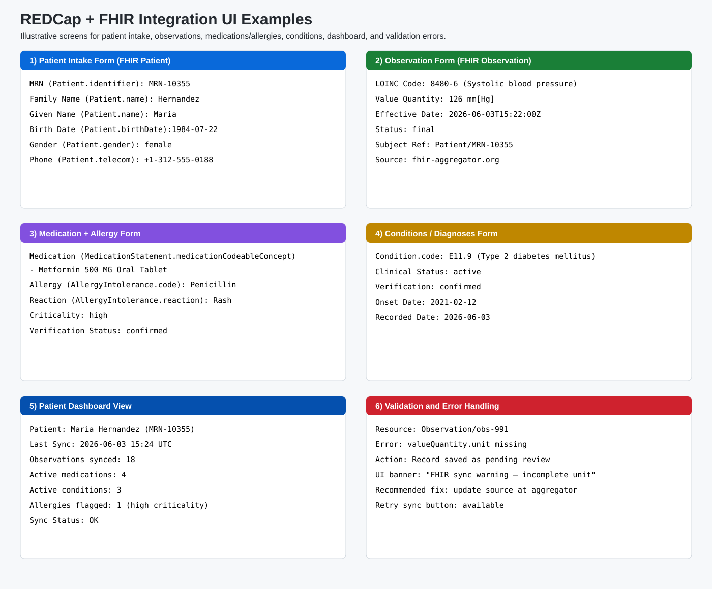
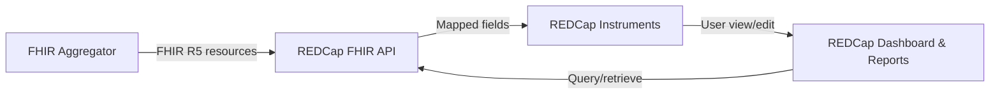
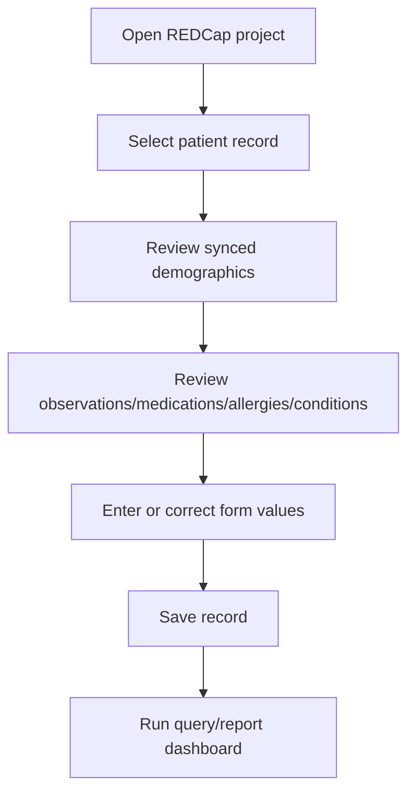
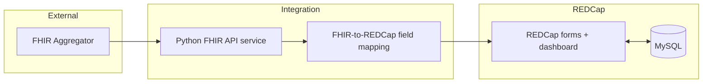

# REDCap Screenshots and Visual Guide

This guide focuses on the REDCap user experience for viewing and entering FHIR-synced patient data.

> **Note**: The image below is an annotated REDCap-style visual reference for documenting expected FHIR field mappings and screen behavior.



## 1) REDCap UI screenshot examples (FHIR mapped)

### Patient data entry form (FHIR `Patient`)
- `record_id` ↔ `Patient.identifier`
- `first_name`, `last_name` ↔ `Patient.name.given` / `Patient.name.family`
- `dob` ↔ `Patient.birthDate`
- `sex` ↔ `Patient.gender`
- `phone` ↔ `Patient.telecom.value`

### Clinical observations display (FHIR `Observation`)
- Observation code (`LOINC`) ↔ `Observation.code`
- Observation value + unit ↔ `Observation.valueQuantity`
- Timestamp ↔ `Observation.effectiveDateTime`
- Source reference ↔ `Observation.subject`

### Medication and allergy data (FHIR `MedicationStatement`, `AllergyIntolerance`)
- Medication name ↔ `MedicationStatement.medicationCodeableConcept`
- Allergy code ↔ `AllergyIntolerance.code`
- Reaction ↔ `AllergyIntolerance.reaction`
- Criticality ↔ `AllergyIntolerance.criticality`

### Conditions/diagnoses entry (FHIR `Condition`)
- Diagnosis code/text ↔ `Condition.code`
- Clinical status ↔ `Condition.clinicalStatus`
- Verification status ↔ `Condition.verificationStatus`
- Onset date ↔ `Condition.onsetDateTime`

## 2) Workflow diagrams

### Data flow: FHIR Aggregator → API → REDCap


### User workflow for viewing and entering data


### Integration architecture diagram


## 3) How to view synced FHIR data in REDCap

1. Log in to REDCap and open the integration project.
2. Open a patient record in the data collection forms.
3. Use demographic and clinical instruments to review synced data:
   - Patient demographics
   - Observations
   - Medications and allergies
   - Conditions/diagnoses
4. Check dashboard/report pages for sync status, counts, and warnings.
5. If validation warnings appear, open the related instrument and correct or re-sync.

## 4) Dashboard views and query/retrieval examples

- **Patient summary dashboard**: last sync timestamp, counts by resource type, and critical alerts.
- **Clinical retrieval workflow**: select patient → filter by resource type/date → open form instrument.
- **Reporting**: use REDCap report builder to filter on mapped fields (e.g., active conditions, high-risk allergies).

## 5) Data validation and error handling screens

The visual example includes a validation panel showing:
- Missing/invalid FHIR elements (example: missing `Observation.valueQuantity.unit`)
- User-facing warning banner
- Retry/resync action guidance

## 6) Sample REDCap instrument definitions (FHIR mapping)

### Example data dictionary mapping

| Variable / Field | REDCap Field Type | FHIR Resource.Path | Example |
|---|---|---|---|
| `record_id` | text | `Patient.identifier.value` | `MRN-10355` |
| `patient_last_name` | text | `Patient.name.family` | `Hernandez` |
| `patient_first_name` | text | `Patient.name.given[0]` | `Maria` |
| `patient_dob` | text (date_ymd) | `Patient.birthDate` | `1984-07-22` |
| `obs_systolic_value` | text (number) | `Observation.valueQuantity.value` | `126` |
| `obs_systolic_unit` | text | `Observation.valueQuantity.unit` | `mm[Hg]` |
| `medication_name` | text | `MedicationStatement.medicationCodeableConcept.text` | `Metformin 500 MG Oral Tablet` |
| `allergy_substance` | text | `AllergyIntolerance.code.text` | `Penicillin` |
| `condition_code` | text | `Condition.code.coding[0].code` | `E11.9` |
| `condition_status` | dropdown | `Condition.clinicalStatus.coding[0].code` | `active` |

### Example REDCap CSV rows
```csv
field_name,form_name,section_header,field_type,field_label,text_validation_type_or_show_slider_number
record_id,demographics,,text,Record ID,
patient_last_name,demographics,Patient,text,Last Name,
patient_first_name,demographics,,text,First Name,
patient_dob,demographics,,text,Date of Birth,date_ymd
obs_systolic_value,observations,Blood Pressure,text,Systolic Value,number
obs_systolic_unit,observations,,text,Systolic Unit,
medication_name,medications,Medication + Allergy,text,Medication Name,
allergy_substance,medications,,text,Allergy Substance,
condition_code,conditions,Condition,text,Condition Code,
condition_status,conditions,,dropdown,Condition Status,
```
